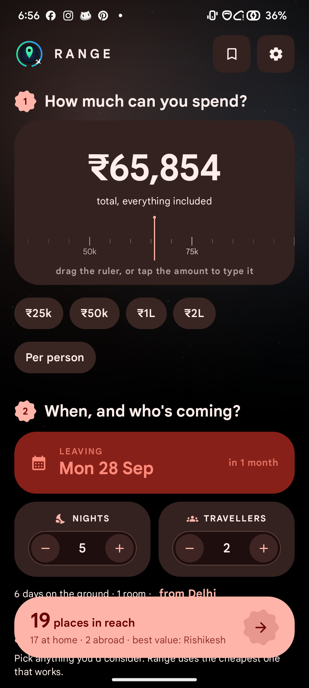

<div align="center">


# Range

### How far can your money take you?

Range starts from your budget, not your destination.<br/>
Tell it what you can spend — it prices the **whole trip** to 180 places and shows you everywhere that actually fits.

[](../../releases/latest)
[](../../actions/workflows/build.yml)
[](https://narzo7.gumroad.com/l/nhlevz)

<sub>Android 8.0+ · Kotlin · Compose · Material 3 Expressive · no account, no ads, no tracking</sub>

</div>

---

## The idea

Every travel app asks *where do you want to go?* and then tells you what it costs. Range inverts it:

> **I've got ₹60,000 and a week in September. Where can I realistically go?**

And it answers for the whole trip — getting there, sleeping, eating, moving around, doing things, visas, insurance and a buffer — priced for your group at your comfort level. Not just the airfare.

<div align="center">



</div>

---

## Install

**[Download the latest APK →](../../releases/latest)**

Open that page on your phone, tap the `.apk`, and allow "install unknown apps" when prompted. Releases are signed and minified; there is no Play listing.

---

## What it does

**Four plain questions**

| | |
|---|---|
| **How much** | Drag the ruler or tap the figure to type it. Per person or for everyone. |
| **When and who** | Date, nights, travellers, rooms. |
| **How you'd travel** | Flight, train, bus, taxi, own car, or "already there" — pick everything you'd consider. |
| **How comfortable** | One Budget / Comfort / Luxury dial, or split it across stay, food and activities. |

**What comes back**

- A live count of how many places are in reach, pinned to the bottom of the screen
- A **range radar** — every destination plotted by true bearing and log-scaled distance, with a boundary drawn through the farthest thing you can afford in each direction
- Cards with the total, the per-head figure, and a wavy meter showing how much of the budget each trip eats
- Per-destination breakdown, a transport comparison, "what if I went budget/luxury", and how far the budget stretches in nights
- Saved trips and a wishlist, stored on device

**Transport it won't lie about**

Range prices every mode you'd consider and uses the cheapest that genuinely works. There's no train to Dubai, no drive to Bali, and no railway to Kaza, Leh or Gangtok. Mountain roads are priced and timed slower than plains. Too short to fly? It substitutes the cheapest sensible surface option and says so.

---

## How the pricing works

Everything is modelled **on device**. Nothing is scraped and no fare API is called, which is why it works with no connection and no account.

| Line | Model |
|---|---|
| **Flights** | `28 + 0.062 × km^0.98` USD, × route competitiveness × season × booking lead time × cabin, × 1.9 for a return, × travellers. Domestic gets ×0.72. |
| **Train / bus** | Per-km rate by class over road distance (great circle × 1.28), return, per traveller — only where a railhead and an overland route exist. |
| **Taxi** | Per-km both ways plus a daily driver allowance, split across cars rather than people. |
| **Own car** | Fuel and tolls per km both ways, plus parking, split across cars. |
| **Stay** | City's mid-tier room rate × tier × season, × rooms × nights. |
| **Food** | City's mid-tier daily spend × tier × travellers × days. |
| **Getting around / doing things** | Scaled by the city's cost-of-living index, tier and party size. |
| **Visa, insurance, buffer** | Per-person entry fees where they apply, daily cover, and a configurable buffer. |

Seasonality comes from each destination's best months plus global holiday spikes. Lead time ranges from ×1.55 (three days out) to ×0.93 (six months out).

Exchange rates are fetched from [Frankfurter](https://www.frankfurter.app/) (keyless) and cached, falling back to rates shipped with the app. **Totals are planning estimates, not fare quotes.**

---

## Build it yourself

Requires **JDK 21** and the Android SDK (**API 37**).

```bash
git clone https://github.com/NikhilKain/Range.git
cd Range
./gradlew assembleDebug
adb install -r app/build/outputs/apk/debug/app-debug.apk
```

No API keys and no `local.properties` secrets are needed for a debug build. Debug installs as `com.vythera.range.debug`, so it sits alongside a release install.

<details>
<summary><b>Signed release builds</b></summary>

Release signing reads `keystore.properties` from the repo root — gitignored, and the keystore itself lives outside the working tree:

```properties
storeFile=/absolute/path/to/range-release.jks
storePassword=…
keyAlias=range
keyPassword=…
```

```bash
./gradlew assembleRelease
```

Without that file the release build still runs, just unsigned. CI signs from repository secrets instead: `RANGE_KEYSTORE_BASE64`, `RANGE_STORE_PASSWORD`, `RANGE_KEY_ALIAS`, `RANGE_KEY_PASSWORD`.

Releases are cut by pushing a tag:

```bash
git tag v1.0.0 && git push origin v1.0.0
```

</details>

---

## Architecture

```
app/src/main/java/com/vythera/range/
├── data/
│   ├── DestinationCatalog.kt   180 destinations — coords, cost index, fare factor,
│   │                           hotel/food anchors, vibes, seasons, visas, terrain
│   ├── OriginCatalog.kt        93 origin cities across every region
│   ├── LiveRates.kt            keyless FX fetch, cached, offline fallback
│   ├── RangeStore.kt           DataStore: settings, saved trips, wishlist
│   └── Palettes.kt             per-destination gradients derived from vibe
├── domain/
│   ├── BudgetEngine.kt         the pricing model and the explore/rank logic
│   ├── SurfaceReach.kt         which places are genuinely road/rail connected
│   ├── Geo.kt                  haversine, bearings, road detour factor
│   └── Money.kt                currencies, live rates, Indian digit grouping
└── ui/
    ├── theme/                  Material You colour, type, expressive shapes
    ├── components/             radar, budget tape, generated artwork, chips
    ├── screens/                onboarding, home, explore, detail, saved, settings
    └── state/RangeViewModel.kt one query object drives everything
```

**Notes**

- **Material 3 Expressive throughout** — `MaterialExpressiveTheme` with the expressive motion scheme, so components move on springs. Real `ButtonGroup`, `ToggleButton`, `LoadingIndicator`, wavy progress and `FloatingToolbar` rather than lookalikes. Requires material3 `1.5.0-alpha24`, pinned above the Compose BOM because the BOM's `1.4.0` doesn't ship that API.
- **Material You by default** — the interface takes its palette from your wallpaper. The app mark and the generated destination artwork keep fixed brand colour; everything else reads scheme roles. Android 11 and below fall back to a neutral slate.
- **Destination artwork is generated at draw time** — skylines, peaks, dunes, coasts and domes derived from each place's vibe and a hash of its id. No image assets, no network, no two cards alike.
- Single module, no annotation processors, no DI framework — a 20-line service locator, so there's no codegen step.
- Ambient animations run on quantised phases, so full-screen canvases redraw a few times a second instead of sixty.

---

## Tests

```bash
./gradlew testDebugUnitTest        # pricing model, catalog integrity
./gradlew connectedDebugAndroidTest # Compose UI  (needs a device)
```

Unit tests cover catalog integrity (unique ids, sane prices, valid coordinates), known real-world distances, that luxury always costs more than budget, that sharing rooms beats booking singles, that booking late costs more than booking early, and the transport reachability rules.

UI tests drive components directly rather than walking the app from onboarding, so they fail when the behaviour under test breaks rather than for four unrelated reasons.

> `connectedDebugAndroidTest` **uninstalls the app when it finishes** — run `./gradlew installDebug` afterwards if you want it back on the device.

CI additionally boots an emulator, walks the app and uploads screenshots as a run artifact.

---

## Support

Range is free, has no ads and tracks nothing. If it saved you a planning headache:

<div align="center">

### [☕ Buy me a coffee](https://narzo7.gumroad.com/l/nhlevz)

</div>

There's the same button in the app under **Settings**. Every contribution genuinely helps. ❤️

## Privacy

No account, no analytics, no ad SDK, no location access. The only network call is the exchange-rate refresh. Saved trips and settings never leave the device. See [PRIVACY_POLICY.md](PRIVACY_POLICY.md).

## Roadmap

- Live fares from a real inventory provider — the transport layer is already an interface, so it slots in behind the model as a fallback
- Multi-city and open-jaw trips
- Sharing a costed trip as an image

---

<div align="center">
<sub>Built by Vythera. All rights reserved.</sub>
</div>
