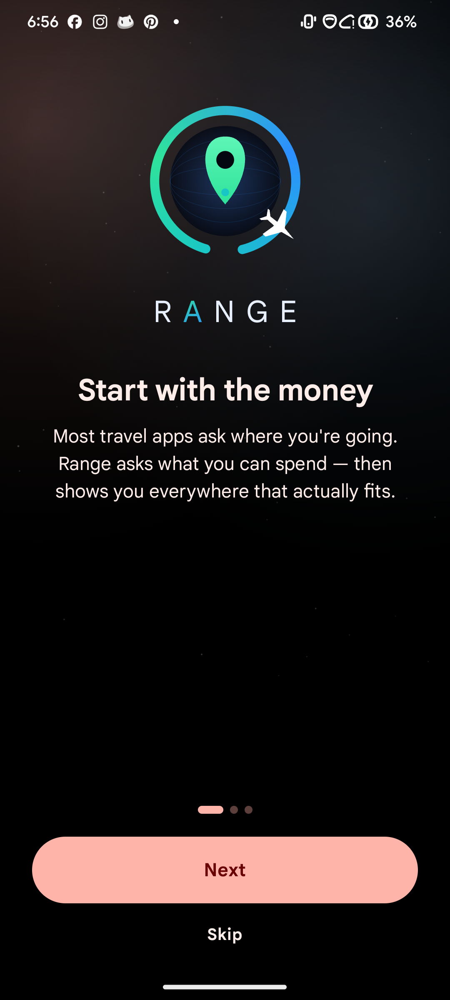
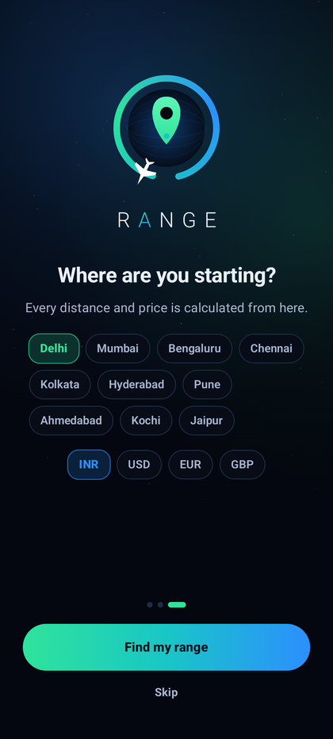
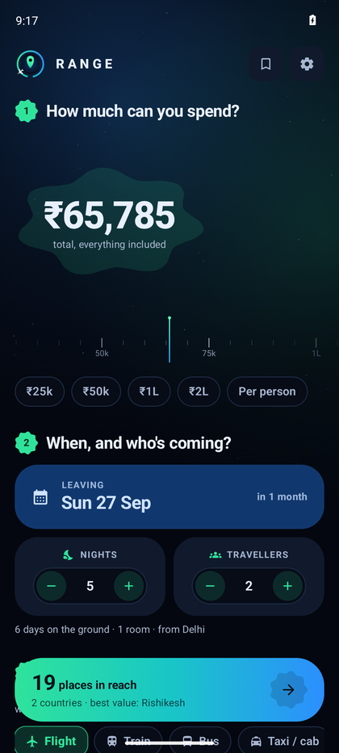
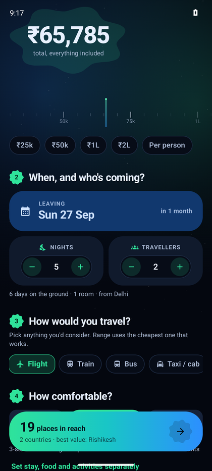

<div align="center">


# Range

**How far can your money take you?**

Range starts from your budget, not your destination. Tell it what you can spend,
when you're going and who's coming — it prices the *whole* trip to 130+ places
and shows you everywhere that actually fits. Start from any of 95 cities
worldwide; the currency follows you.

`com.vythera.range` · Android 8.0+ · Kotlin · Jetpack Compose · Material 3

</div>

---

## The idea

Every other travel app asks "where do you want to go?" and then tells you what it
costs. Range inverts it. You give it a number, and it answers the question people
actually have:

> I've got ₹60,000 and a week in September. Where can I realistically go?

And it answers for the **whole trip** — not just the airfare. Getting there,
sleeping, eating, moving around, doing things, visas, insurance and a safety
buffer, priced for your group size at your comfort level.

## Screenshots

<div align="center">




</div>

## What it does

**Ask four plain questions**
- **How much** — drag a tape-measure ruler, per person or for everyone
- **When and who** — travel date, nights, travellers, rooms
- **How you'd travel** — flight, train, bus, taxi, own car, or "already there"
- **How comfortable** — one Budget / Comfort / Luxury dial, or split it across
  stay, food and activities separately

**Get the whole picture back**
- A live count of how many places are in reach, pinned to the bottom of the screen
- A **range radar**: every destination plotted by true bearing and log-scaled
  distance, with a soft boundary drawn through the farthest thing you can afford
  in each direction
- Cards with the total, the per-head figure, and a wavy meter showing how much of
  the budget each trip eats
- Full cost breakdown per destination, a transport comparison, "what if I went
  budget/luxury", and how many nights the budget stretches to
- Saved trips and a wishlist, both stored on device

**Chooses transport honestly**
- Multi-select what you'd consider; Range prices each one and uses the cheapest
  that works
- Surface travel is offered only where it genuinely exists — no train to Dubai,
  no drive to Bali, no railway to Kaza, Leh or Gangtok
- Mountain roads are priced and timed slower than plains
- Too short to fly? It substitutes the cheapest sensible surface option and says so

## How the pricing works

Range models trip cost on device. Nothing is scraped and no fare API is called,
which is why it works with no connection and no account.

| Line | Model |
|---|---|
| **Flights** | `(28 + 0.062 × km^0.98)` USD, × route competitiveness, × season, × booking lead time, × cabin, × 1.9 for a return, × travellers. Domestic routes get a 0.72 multiplier. |
| **Train / bus** | Per-km rate by class over road distance (great circle × 1.28), return, per traveller. Only where a railhead and an overland route exist. |
| **Taxi** | Per-km both ways plus a daily driver allowance, split across cars, not people. |
| **Own car** | Fuel and tolls per km both ways, plus parking, split across cars. |
| **Stay** | City's mid-tier room rate × tier multiplier × season, × rooms × nights. |
| **Food** | City's mid-tier daily spend × tier multiplier × travellers × days. |
| **Getting around / things to do** | Scaled by the city's cost-of-living index, tier and party size. |
| **Visa, insurance, buffer** | Per-person entry fees where they apply, daily cover, and a configurable buffer on top. |

Seasonality comes from each destination's best months plus global holiday spikes;
lead time ranges from ×1.55 (three days out) to ×0.93 (six months out).

**Live data:** exchange rates are fetched over the internet
([Frankfurter](https://www.frankfurter.app/), keyless) and cached, falling back to
rates shipped with the app when offline. Everything else is computed on device.
Totals are planning estimates, not fare quotes.

## Getting it on your phone

### Option 1 — download the latest build

Every push to `main` builds a debug APK and publishes it to the
**[latest release](../../releases/latest)**. Open that page on your phone, tap
`range-debug.apk`, and allow "install unknown apps" for your browser when asked.

It's also attached to each [Actions run](../../actions) as an artifact named
`range-debug-apk`.

### Option 2 — build it yourself

Requires JDK 21 and the Android SDK (API 37).

```bash
git clone https://github.com/NikhilKain/Range.git
cd Range
./gradlew assembleDebug
adb install -r app/build/outputs/apk/debug/app-debug.apk
```

Or open the folder in Android Studio and press Run. No API keys, no
`local.properties` secrets, no signing setup needed for debug builds.

### Option 3 — release build

```bash
./gradlew assembleRelease   # add your signing config first
```

R8 and resource shrinking are already configured for release.

## Architecture

```
app/src/main/java/com/vythera/range/
├── data/
│   ├── DestinationCatalog.kt   130+ destinations: coords, cost index, fare factor,
│   │                           hotel/food anchors, vibes, seasons, visas, terrain
│   ├── OriginCatalog.kt        95 origin cities across every region
│   ├── LiveRates.kt            keyless FX fetch, cached, offline fallback
│   ├── RangeStore.kt           DataStore: settings, saved trips, wishlist
│   └── Palettes.kt             per-destination gradients derived from vibe
├── domain/
│   ├── BudgetEngine.kt         the pricing model and the explore/rank logic
│   ├── SurfaceReach.kt         which places are genuinely road/rail connected
│   ├── Geo.kt                  haversine, bearings, road detour factor
│   └── Money.kt                currencies, live rates, Indian digit grouping
└── ui/
    ├── theme/                  colour, type, expressive shapes, light + dark
    ├── components/             radar, budget tape, generated artwork, button
    │                           groups, wavy progress, aurora backdrop
    ├── screens/                onboarding, home, explore, detail, saved, settings
    └── state/RangeViewModel.kt one query object drives everything
```

**Notes on the build**
- Single module, no annotation processors, no DI framework — a 20-line service
  locator instead, so the build has no codegen step
- AGP 9 with built-in Kotlin support; opt-ins live at file level
- Destination artwork is **generated at draw time** (skylines, peaks, dunes,
  coasts, domes) from each place's vibe and a hash of its id — no image assets,
  no network, no two cards alike
- Ambient animations run on quantised phases so full-screen canvases redraw a
  few times a second instead of 60, which keeps the app smooth and the battery
  intact

## Tests

```bash
./gradlew testDebugUnitTest
```

Covers catalog integrity (unique ids, sane prices, valid coordinates), known
real-world distances, that luxury always costs more than budget, that sharing
rooms beats booking singles, that booking late costs more than booking early,
and the transport reachability rules (no train to Dubai, no bus to Bangkok, no
railway to Spiti, but trains and cars to Jaipur).

CI also boots an emulator on every push, installs the app, walks through it and
commits the screenshots to `ci/shots/` — so a regression in the UI is visible,
not just a green tick.

## Privacy

No account, no analytics, no ad SDK, no location access. The only network call
is the exchange-rate refresh. Saved trips and settings never leave the device.
See [PRIVACY_POLICY.md](PRIVACY_POLICY.md).

## Roadmap

- Live fares from a real inventory provider (needs an API key — Amadeus,
  Travelpayouts or Kiwi); the transport layer is already an interface, so it
  slots in behind the existing model as a fallback
- Multi-city and open-jaw trips
- Sharing a costed trip as an image
- Widening the catalog past 130 destinations

## License

Built by Vythera. All rights reserved.
